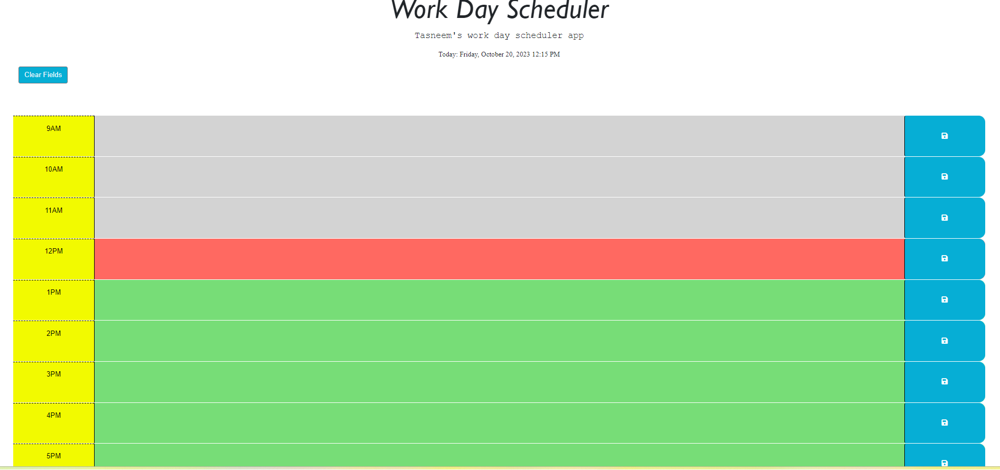
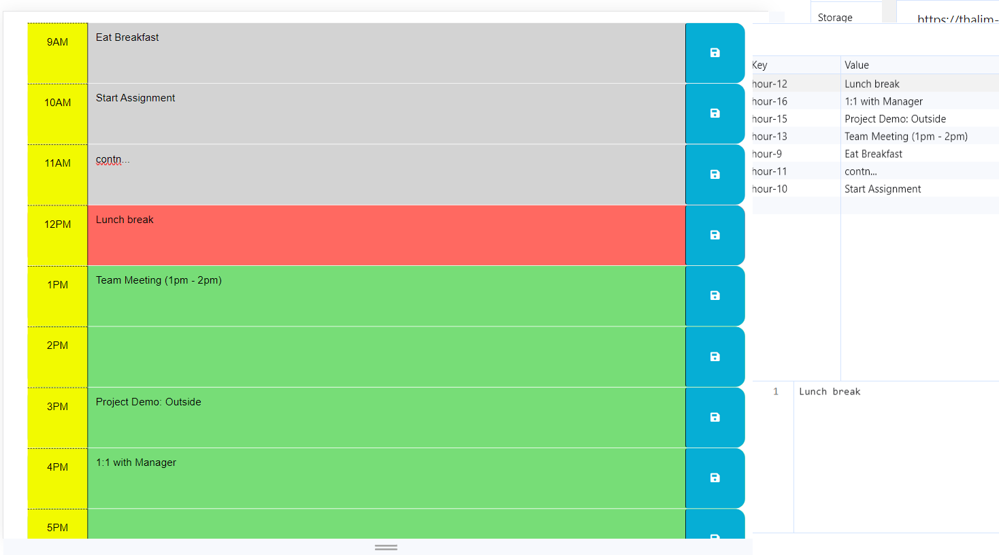

# Tasneem's Work Day Scheduler 

## Description

This is a "Work day scheduler", the 5th challenge/homework for UC Berkley coding boot camp. 
- The name of this challenge "WDth_Scheduler5" simply reflect my work day scheduler :D
- This project helped me to learn more about how jQuery works in JavaScript, how to do dynamic programming and how localstorage works.
 
## Installation

To run the application successfully, we need Microsoft Visual Studio as an editor, Git Bash to clone the github repo and Chrome Dev Tools to inspect the code.

## Task 

-	HTML and CSS is used to design the interface.
-	A starter code is being given and we mostly worked on the JavaScript part.
-	This homework emphasized the importance of using JavaScript web APIs to make dynamic changes to an HTML document.
-	Different event listeners and functions were implemented for user convenience.

## Usage

To see my homework, please go to : https://thalim-glam.github.io/WaPi_quizGen/

Here are the sample screenshots
- Screenshot : Demo of expectation

- Screenshot : Initial clear schedule

- Screenshot: Full Work day Schedule 


## Comand line code

I used a lot of git commands like :
- git status
- git add -A
- git commit -m "Comment goes here"
- git branch
- git push
- git pull origin main
- git checkout main
- git checkout -b feature/add-branch

## Credits

Apart from me :D the credit also goes to my Instructor, TAs, Tutor, Classmates, and 
- Google (my guide everytime I got stuck and lost!)
- Geeks for Geeks
- Stack Overflow
- MDN web doc
- Github docs
- Tutorials Teacher

## User Story

```
AS AN employee with a busy schedule
I WANT to add important events to a daily planner
SO THAT I can manage my time effectively
```

## Acceptance Criteria

```
GIVEN I am using a daily planner to create a schedule
WHEN I open the planner
THEN the current day is displayed at the top of the calendar
WHEN I scroll down
THEN I am presented with time blocks for standard business hours of 9am to 5pm
WHEN I view the time blocks for that day
THEN each time block is color-coded to indicate whether it is in the past, present, or future
WHEN I click into a time block
THEN I can enter an event
WHEN I click the save button for that time block
THEN the text for that event is saved in local storage
WHEN I refresh the page
THEN the saved events persist

```
## License

MIT Lisence
---

## Badges


## Features

In my code I had 1 main branch and crated a few featured branch to test my code and update.
  - I worked on the basic starter code provided from the bootcamp.
  - Added the javaScript code to make it work.
  - Used inspect to monitor my code and it's performance.

## How to Contribute

I followed this https://coding-boot-camp.github.io/full-stack/github/professional-readme-guide as my guidelines to how to write a README file.
I also did tutoring session to understand the homework better.
The TAs were very supportive and guided me a lot.

## Tests

To test the homework, 
  - Please follow the deployed website link. 
  - Click the "Clear Field" button to reset schedule.
  - You can test the application different ways.
  - You can check the "Inspect -> Applications" to see the saved values.

### Done By: Tasneem Halim